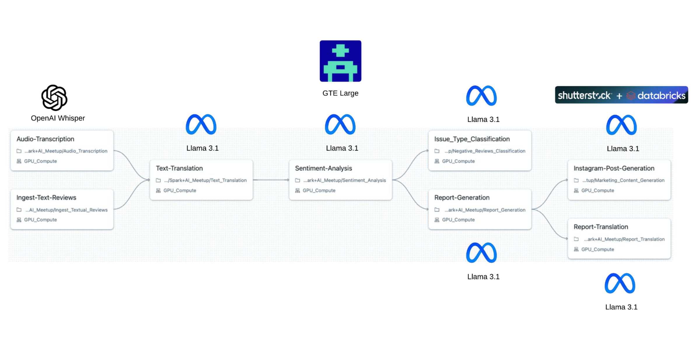
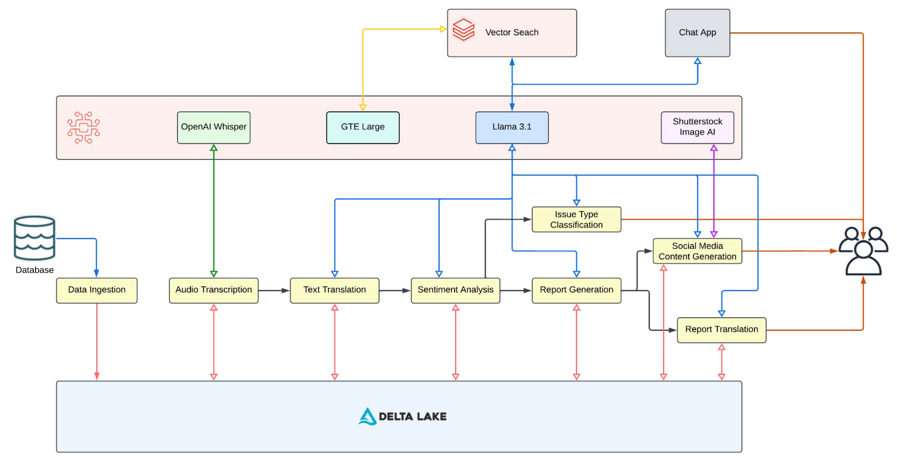
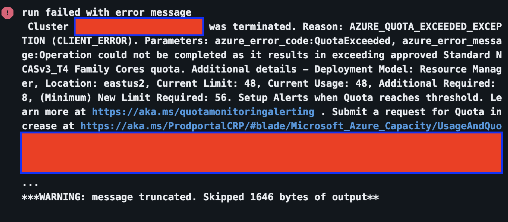

# genai-in-action-on-databricks
 Resources and content for the 'GenAI in Action on Databricks' presentation, delivered at the Spark+AI Meetup held at the Databricks Bellevue Office on November 13, 2024.

## Architecture - Overview

## Architecture - Detailed

For more details, view the PDF: [Demo PDF](GenAI_in_Action_on_Databricks_-_Harshit_Rai.pdf)

## Steps to Execute the Code:

1. Update the `variables` in the `databricks.yml` file to use the desired models. These details can be obtained from the `Serving` section in Databricks UI. 
2. Also, update the `dev` and `prod` workspace host as well as the `serving_endpoint_url` variable in `databricks.yml` file.
3. Depending on whether you're using Databricks on Azure or AWS, comment/uncomment the code in the `resources/Spark+AI_GenAI_Demo.yml` file. Specific details are provided in the file.
4. Once this is done, follow the instructions in the README.md file inside the `genai_in_action_on_databricks` to deploy and run the Databricks Asset Bundle.

Known Issue:
If you're using Azure on Databricks and you see the following error, you might need to increase your quota.

